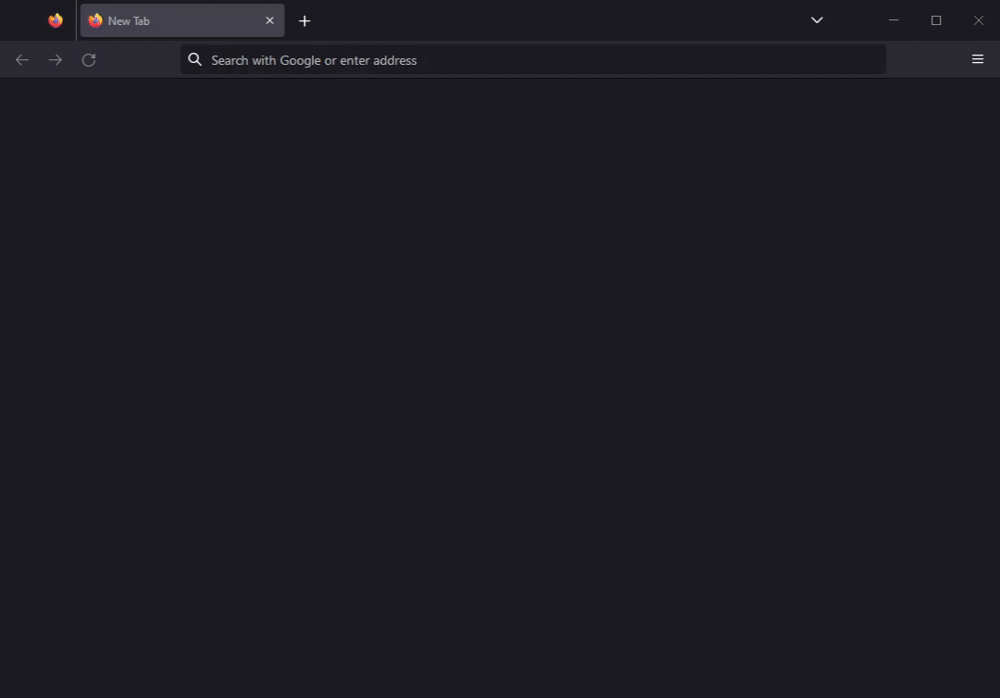

<p align="center">
    <a href="https://www.qytera.de/">
        
    </a>
</p>

<h1 align="center">QTAF - Qytera Test Automation Framework</h1>
<p align="center">
    <strong>The Qytera Test Automation Framework (QTAF) is a Java test framework developed by Qytera GmbH based on TestNG and offers easy setup of new Selenium test projects, HTML reporting, Cucumber support, connection to Jira Xray and fast extensibility.</strong>
    <br>
    <br>
    <a href="https://www.qytera.de/tags/qtaf">Blog</a>
    ·
    <a href="https://github.com/Qytera-Gmbh/QTAF/issues/new?labels=bug">Report bug</a>
    ·
    <a href="https://github.com/Qytera-Gmbh/QTAF/issues/new?labels=enhancement">Request feature</a>
    <br>
    <br>
    <br>
    <a href="https://github.com/Qytera-Gmbh/QTAF/blob/master/LICENSE">
        
    </a>
    <a href="https://makeapullrequest.com">
        
    </a>
    <a href="https://sonarcloud.io/summary/new_code?id=Qytera-Gmbh_QTAF">
        
    </a>
    <a href="https://mvnrepository.com/artifact/de.qytera/qtaf-core/latest">
        
    </a>
</p>

## Table of contents

- [Requirements](#requirements)
- [Quick start](#quick-start)
- [Example usage](#example-usage)
    - [Page object](#page-object)
    - [Test case](#test-case)
- [Documentation](#documentation)
- [Contributing](#contributing)

## Requirements

In order to use QTAF, you will need:

- [Maven 3.8.6](https://maven.apache.org/) or better
- [Java 17](https://openjdk.org/) or better

## Quick start

The easiest way to start using QTAF is by including it in a Maven project's dependencies.
To include QTAF as a testing dependency, add the following lines to your project's `pom.xml`:
```xml
<dependency>
    <groupId>de.qytera</groupId>
    <artifactId>qtaf-core</artifactId>
    <version>0.0.1</version>
    <scope>test</scope>
</dependency>
```
Afterwards, simply run `mvn install` to automatically download and make available QTAF and its dependencies from Maven's Central Repository.

## Example Usage

Having QTAF installed, using it is very straightforward.
A very basic, [page-object-based](https://www.selenium.dev/documentation/test_practices/encouraged/page_object_models/) example for testing https://duckduckgo.com could look like this:

1. open https://duckduckgo.com
2. enter `test automation` into the search area
3. click on the search button
4. assert that the result page's title contains the search term `test automation`

<p align="center">
  <br>
  
  <br>
  The test case visualized.
  <br>
</p>

The test can be realized with two classes: one for the page object and one for the test cases.
The complete project can be found [here](examples/readme).

<details>
    <summary>Click to view project structure</summary>

```bash
src
├───main
│   └───java
└───test
    └───java
        └───de
            └───qtaf
                ├───pages
                │       DuckDuckGoPage.java
                │
                └───tests
                        DuckDuckGoPageTest.java
```
</details>

### Page object

```java
package de.qtaf.pages;

import de.qytera.qtaf.core.guice.annotations.Step;
import de.qytera.qtaf.testng.context.QtafTestNGContext;
import org.openqa.selenium.By;
import org.openqa.selenium.WebElement;

public class DuckDuckGoPage extends QtafTestNGContext {

    @Step(
            name = "open test page",
            description = "opens a browser window and navigates to the test page"
    )
    public void openTestPage() {
        driver.get("https://duckduckgo.com");
        driver.manage().window().maximize();
    }

    @Step(
            name = "enter search term",
            description = "enters the given search term into the search field"
    )
    public void enterSearchTerm(String term) {
        WebElement inputField = driver.findElement(By.id("search_form_input_homepage"));
        inputField.sendKeys(term);
    }

    @Step(
            name = "click search button",
            description = "clicks on the search button next to the search field"
    )
    public void clickSearchButton() {
        driver.findElement(By.id("search_button_homepage")).click();
    }

}
```

### Test case

```java
package de.qtaf.tests;

import de.qtaf.pages.DuckDuckGoPage;
import de.qytera.qtaf.core.config.annotations.TestFeature;
import de.qytera.qtaf.testng.context.QtafTestNGContext;
import org.testng.annotations.Test;

import javax.inject.Singleton;

import static org.testng.Assert.assertTrue;

@TestFeature(
        name = "duckduckgo search",
        description = "tests the search feature from https://duckduckgo.com"
)
@Singleton
public class DuckDuckGoPageTest extends QtafTestNGContext {

    private static final DuckDuckGoPage examplePage = new DuckDuckGoPage();

    @Test(testName = "QTAF-001", description = "test a simple search")
    public void testSearch() {
        examplePage.openTestPage();
        examplePage.enterSearchTerm("test automation");
        examplePage.clickSearchButton();
        assertTrue(driver.getTitle().contains("test automation"));
    }

}
```

## Documentation

You will find an extensive documentation on our GitHub page [qytera-gmbh.github.io](https://qytera-gmbh.github.io/).

## Contributing

Feel free to join our discussion in the [issues](https://github.com/Qytera-Gmbh/QTAF/issues).
If you want to contribute directly, you may do so any time by opening an informal [pull request](https://github.com/Qytera-Gmbh/QTAF/pulls).
